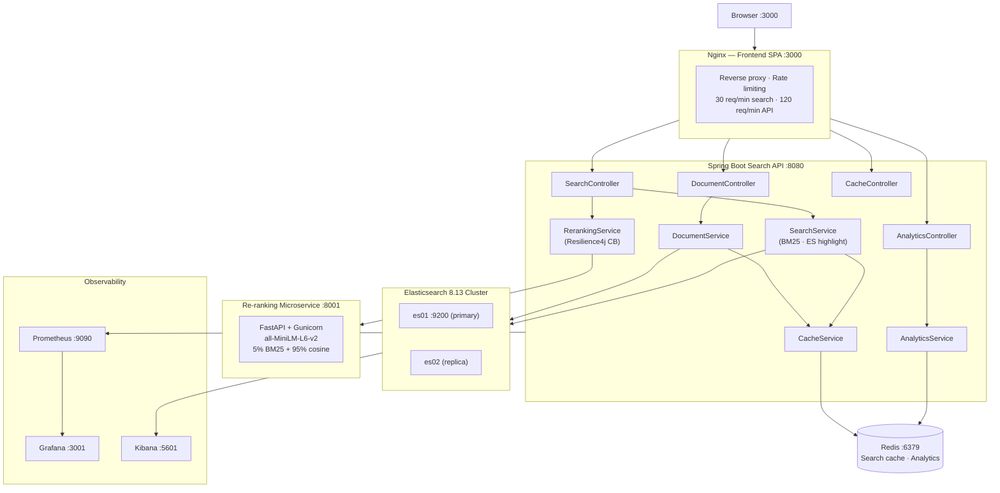

# Distributed Search System — v2


A production-grade distributed search platform combining **BM25 lexical retrieval** with **neural semantic re-ranking**, a **Redis cache layer**, a **dark-themed SPA frontend**, and full **Docker Compose** orchestration. One command starts the entire 9-service stack.

---

## Architecture



---

## What's new in v2

| Area | v1 | v2 |
|---|---|---|
| Elasticsearch | 7.12 (EOL) · `RestHighLevelClient` (deprecated) | **8.13** · new `ElasticsearchClient` |
| Re-ranking service | Flask (single-threaded) · re-fetches documents from ES | **FastAPI + Gunicorn** · receives docs directly |
| ML model | `distilbert-base-nli-stsb-mean-tokens` (deprecated) | **`all-MiniLM-L6-v2`** — 5× faster, higher MTEB score |
| Scoring | BM25 only | **Hybrid: 5% BM25 + 95% cosine similarity** |
| HTTP client | `RestTemplate` (deprecated) | **`WebClient`** (non-blocking) |
| Re-ranker resilience | Hard crash on failure | **Resilience4j circuit breaker** → graceful BM25 fallback |
| Redis safety | `KEYS *` (blocks Redis) | **`SCAN` cursor** (non-blocking) |
| Service URL | Hardcoded `localhost:5000` | **`RERANKING_SERVICE_URL` env-var** |
| API docs | None | **Swagger UI** at `/swagger-ui.html` |
| Metrics | None | **Prometheus + Actuator + Grafana** dashboard |
| Observability | None | **Kibana** for index inspection and log analytics |
| Search result display | Raw text | **ES highlight snippets** — matched terms highlighted in violet |
| Analytics | None | **Analytics tab** — top searched queries and most-clicked documents (Redis sorted sets) |
| Frontend | None | **Dark SPA** with search, comparison, analytics, cache manager, document CRUD, live stats |
| Document ingestion | Manual JSON only | **File upload** (PDF, DOCX, TXT, CSV, JSON, MD…) with text extraction |
| Deployment | 4 separate manual steps | **Single `docker compose up`** (9 services) |

---

## Quick start

```bash
git clone https://github.com/amgharhind/distributed-search-v2.git
cd distributed-search-v2
cp .env.example .env          # review defaults — no changes needed for local dev
docker compose up -d --build
```

All services start in dependency order (health-checked). Elasticsearch takes ~2 min on first boot.

### Load sample documents

```bash
python scripts/load-sample-data.py
python scripts/fix-demo-doc.py     # ensures the BM25-weakness demo doc is correct
```

Loads 15 documents designed to demonstrate re-ranking, caching, and distributed search value.

---

## Service URLs

| Service | URL | Credentials |
|---|---|---|
| **Frontend SPA** | http://localhost:3000 | — |
| Search API | http://localhost:8080 | — |
| Swagger UI | http://localhost:8080/swagger-ui.html | — |
| Health check | http://localhost:8080/actuator/health | — |
| Prometheus metrics | http://localhost:8080/actuator/prometheus | — |
| Re-ranking service docs | http://localhost:8001/docs | — |
| Elasticsearch | http://localhost:9200 | — |
| **Kibana** | http://localhost:5601 | — |
| **Prometheus** | http://localhost:9090 | — |
| **Grafana dashboards** | http://localhost:3001 | admin / admin |

---

## Performance

All numbers measured on the 15-document demo corpus (Apple M2, Docker Desktop):

| Scenario | Latency |
|---|---|
| BM25 search (uncached) | ~5 ms |
| BM25 + re-ranking (uncached, first call) | ~80–120 ms |
| Any search (Redis cache hit) | ~1 ms |
| File upload + text extraction (PDF, 1 MB) | ~200 ms |

Cache hits return results in **~1 ms** regardless of corpus size — look for the `⚡ Cached` badge in the frontend. Run the same query twice to see it.

---

## How the hybrid scoring works

```
final_score = 0.05 × norm_bm25 + 0.95 × cosine_similarity
```

1. **BM25** (Elasticsearch) retrieves the top-50 candidates using the inverted index — fast (~5 ms)
2. **all-MiniLM-L6-v2** encodes the query and all 50 candidates into 384-dimensional vectors
3. **Cosine similarity** measures semantic closeness between query and document embeddings
4. **Hybrid score** blends both signals — 95% semantic weight means the re-ranker visibly reorders results for vocabulary-mismatch queries
5. Results are **sorted by final score** and cached in Redis for subsequent identical queries

If the re-ranking service is unavailable, the **Resilience4j circuit breaker** opens immediately and returns BM25 order — the search endpoint never fails.

---

## Circuit breaker — resilience pattern

A circuit breaker is an electrical metaphor for protecting a system from cascading failures. When the FastAPI re-ranker is failing repeatedly, instead of every request waiting for a timeout and crashing, the circuit "opens" — requests stop reaching the broken service immediately and a fallback kicks in. In this project the fallback returns BM25 order without re-ranking, so search never fails even when the ML service is down.

**Three states:**

| State | Behaviour |
|---|---|
| **Closed** | Normal — requests flow through to the re-ranker |
| **Open** | Circuit tripped — re-ranker is bypassed entirely, BM25 results return in ~5 ms |
| **Half-open** | Recovery probe — one test request is allowed through to check if the re-ranker recovered |

**How it works in this project** — `RerankingService.java`:

```java
@CircuitBreaker(name = "reranking", fallbackMethod = "fallback")
public List<Document> rerank(String query, List<Document> documents) {
    // calls http://reranker:8001/re-rank via WebClient
    // times out after 15s if the ML service is overloaded
}

public List<Document> fallback(String query, List<Document> documents, Throwable ex) {
    log.warn("Re-ranking unavailable ({}), returning BM25 order", ex.getMessage());
    return documents;  // search never fails — just degrades gracefully
}
```

**Configuration** — `application.yml`:

```yaml
resilience4j:
  circuitbreaker:
    instances:
      reranking:
        slidingWindowSize: 10               # evaluate last 10 calls
        minimumNumberOfCalls: 5             # need at least 5 before tripping
        failureRateThreshold: 60            # open if 60%+ calls fail
        slowCallDurationThreshold: 12s      # calls over 12s count as failures
        slowCallRateThreshold: 80           # open if 80%+ calls are slow
        waitDurationInOpenState: 15s        # wait before trying half-open
        permittedNumberOfCallsInHalfOpenState: 3
```

**The key insight:** this pattern separates *availability* from *capability*. The system remains 100% available (always returns results) even when the ML service is degraded. That is production thinking — a system that degrades gracefully under failure is more valuable than one that is faster but brittle.

---

### Try it live — the BM25 weakness demo

1. Open http://localhost:3000 → **Search** tab
2. Type `fast document retrieval` and click **Compare BM25 vs Re-ranked**
3. With re-ranking **OFF** (BM25 only): the Ferrari cars document ranks **#1** — it contains the exact keywords "fast", "document", "retrieval" but is semantically about cars
4. With re-ranking **ON**: the Ferrari doc drops to **last place** — the 95% semantic weight correctly identifies it as off-topic
5. This is BM25's classic **vocabulary mismatch problem**, solved by neural re-ranking

---

## Demo queries

Run these in the **Search** tab of the frontend:

| Query | What it shows |
|---|---|
| `fast document retrieval` | Toggle Re-rank — Ferrari cars doc drops from #1 with BM25 to last with re-ranking |
| `how does semantic search work` | BM25 misses conceptual matches; re-ranker surfaces them |
| `cache latency performance` | Run twice — second response shows ⚡ Cached badge and ~1 ms |
| `circuit breaker microservices` | Finds resilience docs via semantic similarity, not exact keywords |
| `distributed search production` | Broad query — shows full corpus coverage and score bars |

---


## Docker commands

### Start / stop

```bash
# Start all 9 services in background
docker compose up -d --build

# Stop all services (keeps data)
docker compose down

# Stop and wipe all volumes (deletes ES index and Redis cache)
docker compose down -v
```

### Rebuild individual services

```bash
# Java backend changed (controllers, services, pom.xml)
docker compose up -d --build search-api

# Python re-ranker changed (reranker.py, models.py, requirements)
docker compose up -d --build reranker

# Frontend changed (index.html, nginx.conf)
# No rebuild needed — changes are served immediately.
# Just reload the browser.
```

### Inspect logs

```bash
docker logs search-api --tail 50 -f   # structured JSON logs
docker logs reranker   --tail 50 -f
docker logs es01       --tail 50 -f
docker logs kibana     --tail 50 -f
```

### Check container health

```bash
docker ps --format "table {{.Names}}\t{{.Status}}"
```

---

## API reference

### Search

| Method | Endpoint | Description |
|---|---|---|
| `GET` | `/api/v2/search` | Full-text search with caching and re-ranking |
| `GET` | `/api/v2/search/wildcard` | Wildcard search (`pattern=distrib*`) |
| `GET` | `/api/v2/search/exact-phrase` | Exact phrase match |
| `GET` | `/api/v2/search/proximity` | Proximity / slop search |
| `GET` | `/api/v2/search/range` | Range search on date or numeric field |
| `POST` | `/api/v2/search/interaction/{id}` | Record a document click |

**Full-text search parameters**

| Param | Default | Description |
|---|---|---|
| `query` | — | Search terms |
| `field` | `content` | Field to search |
| `fileType` | — | Filter by file type (`pdf`, `docx`, `txt`…) |
| `sortField` | — | Sort by field (`createdDate`, `title`…) |
| `sortOrder` | `desc` | `asc` or `desc` |
| `page` | `0` | Page number (0-indexed) |
| `size` | `10` | Results per page |
| `cache` | `true` | Use Redis cache |
| `rerank` | `true` | Apply semantic re-ranking |

### Documents

| Method | Endpoint | Description |
|---|---|---|
| `POST` | `/api/v2/documents` | Index a document from JSON body |
| `POST` | `/api/v2/documents/bulk` | Bulk-index multiple documents |
| `POST` | `/api/v2/documents/upload` | Upload a file (PDF, DOCX, TXT, CSV, MD…) — text extracted automatically |
| `GET` | `/api/v2/documents` | List documents with pagination |
| `GET` | `/api/v2/documents/{id}` | Get document by ID |
| `PUT` | `/api/v2/documents/{id}` | Update a document |
| `DELETE` | `/api/v2/documents/{id}` | Delete a document |

**Upload example**

```bash
curl -X POST http://localhost:8080/api/v2/documents/upload \
  -F "file=@report.pdf" \
  -F "author=Jane Doe" \
  -F "title=Q4 Report"
```

### Cache

| Method | Endpoint | Description |
|---|---|---|
| `GET` | `/api/v2/cache/keys` | List all cached keys (safe SCAN) |
| `DELETE` | `/api/v2/cache?key=…` | Evict a specific cache key |
| `DELETE` | `/api/v2/cache/all` | Clear entire cache |

---

## Troubleshooting

### Elasticsearch stays unhealthy on first boot

ES takes up to 2 minutes to initialize on first start. Check progress:

```bash
docker logs es01 --tail 30 -f
# Wait until you see: "started" and "elected-as-master"
```

If it's been more than 5 minutes:

```bash
docker compose down -v   # wipes volumes
docker compose up -d     # fresh start
```

### Re-ranking service returns BM25 results (circuit breaker open)

The re-ranker needs ~30 seconds to load the ML model on first boot. The circuit breaker opens after 5 slow calls. Check:

```bash
docker logs reranker --tail 20
# Look for: "Application startup complete."
curl http://localhost:8001/health
```

Once the reranker is healthy, the circuit breaker will transition back to CLOSED after the next successful call.

### `docker compose up` fails with "port already in use"

Another process is using port 9200, 6379, 8080, or 3000. Find and stop it, or change the host port in `docker-compose.yml`.

### Frontend shows stale results after adding documents

Documents are cached in Redis. Clear the cache from the **Cache** tab in the frontend, or:

```bash
curl -X DELETE http://localhost:8080/api/v2/cache/all
```

### Kibana shows "Index not found"

The `documents` index is only created when the first document is indexed. Run the sample data script first:

```bash
python scripts/load-sample-data.py
```

---

## CI / CD

GitHub Actions runs on every push to `master`:

- **Java job** — `mvn test` inside `search-api/`
- **Python job** — `pytest tests/ -v` with lightweight mocks (no PyTorch in CI)

Badge at the top of this file reflects the latest build status.

---

## Tech stack

| Layer | Technology |
|---|---|
| Core API | Spring Boot 3.2 · Java 21 |
| Search engine | Elasticsearch 8.13 (2-node cluster) |
| Re-ranking | FastAPI · Gunicorn · sentence-transformers |
| ML model | `all-MiniLM-L6-v2` (384-dim, MTEB top-10) |
| Hybrid scoring | 5% BM25 + 95% cosine similarity |
| Cache | Redis 7.2 (SCAN-safe eviction) |
| Resilience | Resilience4j circuit breaker |
| HTTP client | Spring WebClient (non-blocking) |
| File extraction | Apache PDFBox 3 · Apache POI |
| API docs | Springdoc OpenAPI (Swagger UI) |
| Metrics | Micrometer · Prometheus · Grafana |
| Log analytics | Kibana 8.13 (structured JSON logs) |
| Search highlighting | Elasticsearch highlight API (160-char fragments, `<em>` markers) |
| Click analytics | Redis sorted sets (`ZINCRBY`) + SCAN-based aggregation |
| Frontend | Vanilla JS SPA · nginx reverse proxy |
| Rate limiting | nginx `limit_req_zone` (30/min search, 120/min API) |
| Containerisation | Docker · Docker Compose (9 services) |
| CI | GitHub Actions |

---

## Project structure

```
distributed-search-v2/
├── docker-compose.yml              # Full-stack orchestration (9 services)
├── .env.example                    # Environment variable template (copy → .env)
├── .github/
│   └── workflows/build.yml         # CI — Java + Python parallel jobs
├── prometheus/
│   └── prometheus.yml              # Prometheus scrape config
├── grafana/
│   └── provisioning/               # Auto-provisioned datasource + dashboard
├── frontend/
│   ├── index.html                  # Dark SPA (search, stats, side-by-side, cache, documents)
│   └── nginx.conf                  # Reverse proxy + rate limiting
├── scripts/
│   ├── load-sample-data.py         # 15 demo documents via bulk API
│   └── fix-demo-doc.py             # Ensures BM25-weakness demo document is correct
├── search-api/                     # Spring Boot application
│   ├── Dockerfile
│   ├── pom.xml
│   └── src/main/java/com/search/distributed/
│       ├── config/                 # ES, Redis, WebClient beans
│       ├── controller/             # SearchController, AnalyticsController,
│       │                           # CacheController, DocumentController
│       ├── service/                # SearchService (BM25 + highlight), RerankingService,
│       │                           # AnalyticsService, CacheService,
│       │                           # DocumentService, InteractionService
│       ├── model/                  # Document, SearchResult, RerankRequest, DocumentRequest
│       └── exception/              # GlobalExceptionHandler
└── reranking-service/              # FastAPI re-ranking microservice
    ├── Dockerfile
    ├── gunicorn.conf.py
    ├── requirements.txt
    ├── requirements-dev.txt        # Lightweight deps for CI (no PyTorch)
    ├── tests/                      # pytest — 6 API tests with mocked model
    └── app/
        ├── main.py                 # FastAPI app + /health + /re-rank
        ├── reranker.py             # Async hybrid scoring (5% BM25 + 95% cosine)
        └── models.py               # Pydantic request/response models
```

---

## Compared to v1

The original v1 implementation had these production blockers — all fixed in v2:

- `http://localhost:5000` hardcoded → breaks inside Docker containers
- `KEYS *` Redis command → blocks the entire Redis instance under load
- Flask dev server → single-threaded, queues under concurrent searches
- Re-ranking service re-fetched documents from ES → doubled the ES load
- No docker-compose for Spring Boot or Flask → four manual startup steps
- Deprecated `distilbert-base-nli-stsb-mean-tokens` model
- No fallback when re-ranker was down → entire search request failed
- No frontend — API-only, required curl or Postman for every interaction

---

## License

MIT
